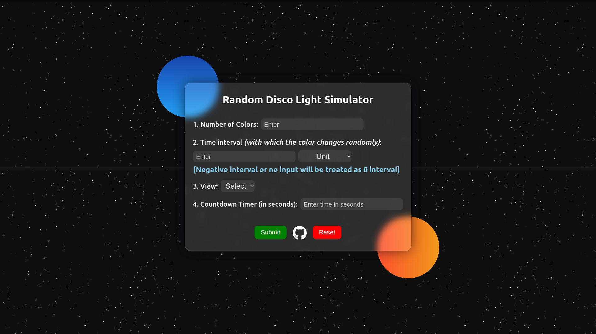

# Random Disco Light Simulator

## This simulator takes three inputs:

### Inputs:

1. How many random colors you want to be shown?
2. With how much time interval (in milliseconds) you want to change the colors randomly?
3. What type of view you want to choose (conic, linear or radial)?
4. Countdown timer (in seconds)

## Output:

On the basis of these inputs, it simulates the selected view.

## Try these inputs:

<table>
        <tr>
        <td>
            <ul>
                <li>1000</li>
                <li>1 milliseconds</li>
                <li>conic</li>
                <li>60</li>
            </ul>
        </td>
        <td>
            <ul>
                <li>1000</li>
                <li>1 milliseconds</li>
                <li>radial</li>
                <li>60</li>
            </ul>
        </td>
        <td>
            <ul>
                <li>2</li>
                <li>500 milliseconds</li>
                <li>linear</li>
                <li>60</li>
            </ul>
        </td>
        <td>
            <ul>
                <li>1000</li>
                <li>1 milliseconds</li>
                <li>linear</li>
                <li>60</li>
            </ul>
        </td>
        </tr>

</table>

## Screenshot of the website 

## Our Contributors  !! ✨
### Thanks to these wonderful people: ✨

<table>
	<tr>
		<td>
			
		</td>
	</tr>
</table>

### Have a fun! 😄

## 🔗 Link:

https://sk66641.github.io/Random-Disco-Light-Simulator/
