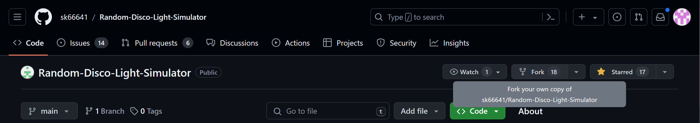

# Learn.md

Welcome to the Random Disco Light Simulator! This document will guide you through the process of contributing to our project. We value the time and effort of our contributors and strive to create an inclusive and collaborative community. Thank you for helping out and remember, no contribution is too small.

## Table of Contents 📊
1. [Project Overview](#project-overview)
2. [Installation](#installation-️)
3. [How to Contribute](#how-to-contribute)
4. [Development Workflow](#development-workflow)
5. [Issue Report Process](#issue-report-process)
6. [Getting Started with Git and GitHub](#getting-started-with-git-and-github)
7. [Pull Request Process](#pull-request-process)
8. [Community Guidelines](#community-guidelines)
9. [Documentation](#documentation)
10. [Code Reviews](#code-reviews)
11. [Feature Requests](#feature-requests)
12. [Spread the Word](#spread-the-word)

## Project Overview 📁

### Inputs:
1. **Number of random colors to be shown.**
2. **Time interval (in milliseconds) for changing colors randomly.**
3. **View type (conic, linear, or radial).**
4. **Countdown timer (in seconds).**

### Output:
Based on these inputs, the simulator displays the selected view with the specified behavior.

### Example Inputs:


## Installation 🛠️

### Step 1: Fork the Repository
Fork the `Random-Disco-Light-Simulator` repository to your own GitHub account. This will create a copy of the repository under your GitHub account, which you can modify without affecting the original project.

Follow these instructions to fork a repository: [GitHub Forking Guide](https://docs.github.com/en/github/getting-started-with-github/fork-a-repo)



### Step 2: Clone the Repository
After forking the repository, clone it to your local machine. You can do this using SSH or HTTPS.

#### Using SSH
```bash
git clone git@github.com:sk66641/Random-Disco-Light-Simulator.git
```
#### Using HTTPS
```bash
git clone https://github.com/sk66641/Random-Disco-Light-Simulator.git
```


### Step 3: Navigate to the Project Directory
Change into the project directory using the cd command:
```bash
cd Random-Disco-Light-Simulator
```

## How to Contribute 🎉
## Getting Started with Git and GitHub
Refer to the following articles:
- [Forking a Repo](https://help.github.com/en/github/getting-started-with-github/fork-a-repo)
- [Cloning a Repo](https://help.github.com/en/desktop/contributing-to-projects/creating-an-issue-or-pull-request)
- [How to create a Pull Request](https://opensource.com/article/19/7/create-pull-request-github)
- [Getting started with Git and GitHub](https://towardsdatascience.com/getting-started-with-git-and-github-6fcd0f2d4ac6)
- [Learn GitHub from Scratch](https://docs.github.com/en/get-started/start-your-journey/git-and-github-learning-resources)
### Ways to Contribute
1. **Fork the repo** and create a new folder for your game files.
2. **Work on specific issues**: Subdivide the game into parts (prompts, assets, code).
3. **Submit a pull request** after completing your task.
4. **Avoid changing someone else's file** and maintain originality.
5. **Levels** will be given based on effort.
6. **Contact Project Admin** for any issues.

### GitHub Desktop Alternative
1. **Clone the repository** using GitHub Desktop.
2. **Switch to the correct branch** for your pull request.
3. **Make changes** using your preferred code editor.
4. **Commit changes** with a clear summary and description.
5. **Push changes** to your forked repository on GitHub.
6. **Create a pull request** on GitHub and submit it for review.

## Development Workflow
1. **Work on a new branch** for each issue or feature.
2. **Keep your branch up to date** with the master branch.
3. **Write clear commit messages**.
4. **Test changes thoroughly** before submitting.
5. **Maintain polite and respectful discussions**.

## Issue Report Process
1. **Go to the project's issues** and select the appropriate template.
2. **Provide a proper description** for the issues.
3. **Do not spam** for issue assignments.
4. **Start working only after issue assignment**.

## Pull Request Process
1. **Self-review your code** before submission.
2. **Add a proper description** of the code functionality.
3. **Comment your code**, especially in hard-to-understand areas.
4. **Add a screenshot** to help in the review process.
5. **Submit the PR** with necessary information in the PR template.


## Community Guidelines 📋
1. **Be respectful and considerate** towards others.
2. **Use inclusive language** and promote a welcoming environment.
3. **Avoid personal attacks, harassment, or discrimination**.
4. **Keep discussions on-topic and constructive**.
5. **Help others** and contribute positively.

## Documentation 📜
1. **Document significant changes** or additions.
2. **Provide clear explanations** of functionality and usage.

## Code Reviews 🔎
1. **Be open to feedback** and constructive criticism.
2. **Participate in code reviews** by providing feedback.

## Feature Requests
1. **Suggest new features** or improvements.

## Spread the Word 🙌🏻
1. **Share your experience** and the project with others.
2. **Promote the project** on social media, developer forums, or community platforms.
## Conclusion
Thank you for your valuable contribution and for being a part of our community! Together, we can make a difference. Happy contributing! 🚀
## 🙏 Support

This project needs a ⭐️ from you. Don't forget to leave a star ⭐️